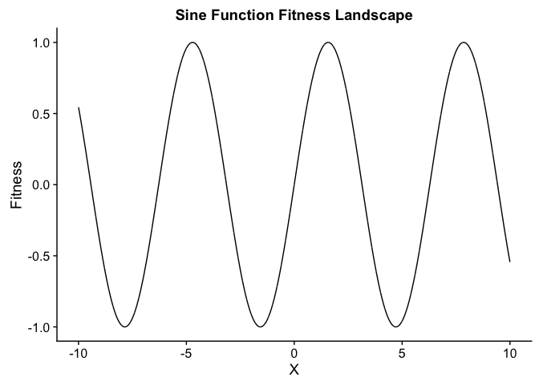
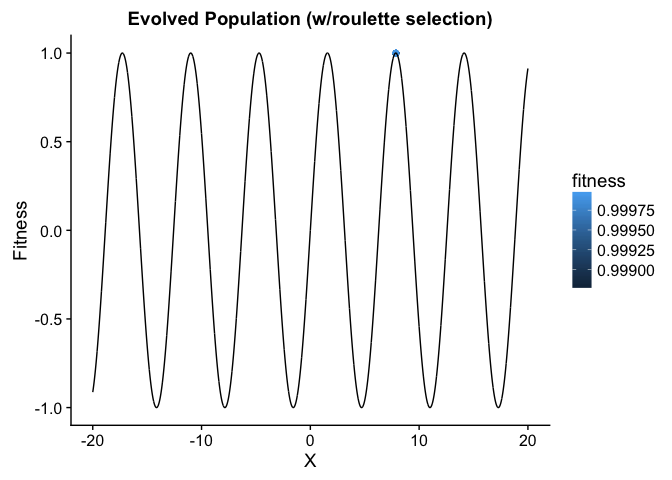

## Experiments

- [ ] tournament size effect
- [ ] random population vs seeded population
- [ ] small effect mutations vs large effect mutations
- [ ] small population size vs very large population size
- [ ] different landscape
  - sine(x) + shifted sine(x)

## Setup

First, we'll load a few useful libraries:


```r
library(ggplot2)    # (Wickham, 2009)
library(cowplot)    # (Wilke, 2018)
```

- [ggplot2](https://ggplot2.tidyverse.org/) is a system for creating graphics.
- [cowplot](https://cran.r-project.org/web/packages/cowplot/vignettes/introduction.html) is an add-on to ggplot2. cowplot provides a clean default theme for graphics and provides several useful utilities (e.g., plot_grid).

## A simple evolutionary algorithm

### Evolving in the sine landscape

In this example, we'll evolve a population of _individuals_ where each individual is represented by an integer and each individual's fitness is equal its sine.

In R:


```r
calc_fitness <- function(x) {
  return(sin(x))
}
```

Using ggplot, we can visualize our fitness function:


```r
# Plot the 'sine' fitness landscape (-10 <= x <= 10)
ggplot(data.frame(x = c(-10, 10)), aes(x)) +
  stat_function(fun = calc_fitness, geom = "line", n=10000) +
  xlab("X") + ylab("Fitness") + ggtitle("Sine Function Fitness Landscape")
```

<!-- -->


For this simple evolutionary algorithm, we need to set a few parameters:


```r
pop_size <- 100
generations <- 100
tournament_size <- 2
mutation_rate <- 0.1
max_indiv_value <- 20
min_indiv_value <- -20
```

- `pop_size` (100): How many individuals are present in the population at any given time?
- `generations` (100): How many generations (rounds) of evolution will we run our evolutionary algorithm for?
- `tournament_size` (2): When selecting parents to reproduce, how large should tournaments be?
- `mutation_rate` (0.1): With what probability should we mutate offspring?
- `max_indiv_value` (20): What is the maximum value we allow individuals to be?
- `min_indiv_value` (-20): What is the minimum value we allow individuals to be?

#### Generating an initial population

Before jumping into the evolution loop of an evolutionary algorithm, we want to generate an initial population. To start, we'll generate random individuals for our initial population.


```r
population <- runif(pop_size, min=min_indiv_value, max=max_indiv_value)
```

How fit is our initial population? We can use ggplot to plot our random initial population in our sine fitness landscape.


```r
# Plot the initial population
ggplot(data.frame(x = population, fitness = calc_fitness(population)), aes(x = x,y = fitness, color = fitness)) +
  geom_point() +
  stat_function(fun = calc_fitness, geom = "line", n = 10000) +
  scale_color_gradient() +
  xlab("X") + ylab("Fitness") + ggtitle("Initial Population")
```

<!-- -->

#### Selecting parents

Every generation, our evolutionary algorithm needs some way to decide which members of the population get to reproduce.

##### Tournament selection

One simple parent selection algorithm is tournament selection. To select a parent, we randomly select N tournament participants from the population, and we host a tournament where these randomly selected participants duke it out according to their fitness. The winner of the brawl is the participant with the highest fitness. 

In R:


```r
# Params:
# - pop: the population of individuals from which to select a parent
# - fit_fun: a fitness function that takes an individual as input and returns that individual's fitness
# - tourny_size: the size of the tournament
# - tourny_cnt: how many tournaments should we run?
tournament_select_single <- function(pop, fit_fun, tourny_size) {
  # gather the tournament participants!
  combatants <- sample(pop, size=tourny_size, replace=TRUE)
  # who wins?
  best_i <- which.max(fit_fun(combatants))
  # return the winner
  return(combatants[best_i])
}

# return results from multiple tournaments
tournament_select <- function(pop, fit_fun, tourny_size, tourny_cnt) {
  winners = rep(0, tourny_cnt)
  for (i in 1:length(winners)) {
    winners[i] = tournament_select_single(pop, fit_fun, tourny_size)
  }
  return(winners)
}
```

##### Roulette selection


```r
roulette_select <- function(pop, fit_fun, cnt) {
  fitnesses <- fit_fun(pop)
  # not perfect way to get weights, but avoids division by 0 and higher fitnesses have higher weights
  weights <- (fitnesses+min(fitnesses)+1)/sum(fitnesses+min(fitnesses)+1)
  return(sample(pop, size = cnt, replace = TRUE, prob = weights))
}
```

#### Mutating offspring


```r
mutate <- function(x, mut_prob, min_x=-20, max_x=20, sd=0.005*pi) {
  # Flip a biased coin
  # if heads (prob=mut_prob): mutate
  # else: no mutation
  if (rbinom(1, size=1, prob=mut_prob) == 1) {
    x <- x + rnorm(1, mean=0, sd=sd)
  }
  return(x)
}
```

Let's look at how this mutation operator moves genomes in the fitness landscape by generating a bunch of mutated offspring of the individual `x=0` with a mutation rate of 0.1.


```r
parents <- rep(0, 1000)
mutants_mut_rate_0.1 <- sapply(parents, mutate, 0.1)
```

Plot all of the mutants in our landscape.


```r
ggplot(data.frame(x = mutants_mut_rate_0.1, fitness = calc_fitness(mutants_mut_rate_0.1)), aes(x = x, y = fitness, color = fitness)) +
  geom_point() +
  stat_function(fun = calc_fitness, geom = "line", n = 10000) +
  xlim(-20, 20) +
  scale_color_gradient() +
  xlab("X") + ylab("Fitness") + ggtitle("Mutants! (Mutation rate = 0.1)")
```

<!-- -->

```r
# distribution of mutants
ggplot(data.frame(x = mutants_mut_rate_0.1), aes(x = x)) +
  geom_histogram(bins=10) +
  xlab("X") + ylab("Count") + ggtitle("Distribution of mutanted individuals")
```

<!-- -->

What if we increase the step size of our mutation rate?


```r
parents <- rep(0, 1000)
mutants_mut_rate_0.1 <- sapply(parents, mutate, 0.1, -20, 20, 0.5*pi)
```


```r
ggplot(data.frame(x = mutants_mut_rate_0.1, fitness = calc_fitness(mutants_mut_rate_0.1)), aes(x = x, y = fitness, color = fitness)) +
  geom_point() +
  stat_function(fun = calc_fitness, geom = "line", n = 10000) +
  xlim(-20, 20) +
  scale_color_gradient() +
  xlab("X") + ylab("Fitness") + ggtitle("Mutants! (Mutation rate = 0.1)")
```

<!-- -->

```r
# distribution of mutants
ggplot(data.frame(x = mutants_mut_rate_0.1), aes(x = x)) +
  geom_histogram(bins=10) +
  xlab("X") + ylab("Count") + ggtitle("Distribution of mutanted individuals")
```

<!-- -->

#### Evolution!


```r
evolve_tourny <- function(population, generations) {
  for (gen in 1:generations) {
    # Evaluate! ==> Because evaluations in this case are so fast, we're going to
    #               evaluate candidate solutions 'on-the-fly' during selection.
    # Select parents!
    #   - Asexual reproduction, tournament selection, no elitism!
    new_population <- tournament_select(population, calc_fitness, tournament_size, length(population))
    new_population <- sapply(new_population, mutate, 
                             mut_prob=mutation_rate, 
                             min_x=min_indiv_value, 
                             max_x=max_indiv_value)
    
    # Current population = new offspring
    population <- new_population
  }
  return(population);
}

evolve_roulette <- function(population, generations) {
  for (gen in 1:generations) {
    # Evaluate! ==> Because evaluations in this case are so fast, we're going to
    #               evaluate candidate solutions 'on-the-fly' during selection.
    # Select parents!
    #   - Asexual reproduction, tournament selection, no elitism!
    new_population <- roulette_select(population, calc_fitness, length(population))
    new_population <- sapply(new_population, mutate, 
                             mut_prob=mutation_rate, 
                             min_x=min_indiv_value, 
                             max_x=max_indiv_value)
    
    # Current population = new offspring
    population <- new_population
  }
  return(population);
}
```

Evolve w/tournament selection:


```r
pop_evo_tourny <- evolve_tourny(population, 10)
# Plot the initial population
ggplot(data.frame(x=pop_evo_tourny, fitness=calc_fitness(pop_evo_tourny)), aes(x=x,y=fitness,color=fitness)) +
  geom_point() + xlim(-20, 20) +
  stat_function(fun=calc_fitness, geom="line", n=10000) +
  scale_color_gradient() +
  xlab("X") + ylab("Fitness") + ggtitle("Evolved Population (w/tournament selection)")
```

<!-- -->

Evolve with roulette selection:


```r
pop_evo_roulette <- evolve_tourny(population, 10)
# Plot the initial population
ggplot(data.frame(x=pop_evo_roulette, fitness=calc_fitness(pop_evo_roulette)), aes(x=x,y=fitness,color=fitness)) +
  geom_point() + xlim(-20, 20) +
  stat_function(fun=calc_fitness, geom="line", n=10000) +
  scale_color_gradient() +
  xlab("X") + ylab("Fitness") + ggtitle("Evolved Population (w/roulette selection)")
```

<!-- -->
